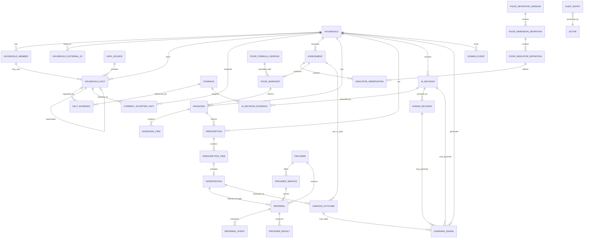

# Hamoon — Data Model v1 + ERD

> وضعیت: Technical Data Architecture Baseline v1  
> وابسته به: `HAMOON_AI_ARCHITECTURE_BASELINE.md` و `HAMOON_TECHNICAL_ARCHITECTURE_V1.md`  
> اصل راهنما: **داده در Hamoon برای بازسازی وضعیت، تصمیم، اقدام، پیامد و یادگیری نگهداری می‌شود؛ نه صرفاً برای نمایش CRUD.**

---

# 1. هدف

این سند مدل داده منطقی Hamoon را تثبیت می‌کند تا تمام لایه‌های زیر روی یک پایه واحد ساخته شوند:

- Household & Case Management
- Temporal Family Data
- Current Accepted State
- PGOR Assessment
- Diagnosis
- Prescription
- Intervention
- Provider & Referral
- Provider Result
- Hamoon Outcome
- AI Decision Trace
- Human-in-the-loop
- Learning Signals
- Audit / Events
- Integration

این نسخه **Logical Data Model** است و عمداً به PostgreSQL، SQL Server، MongoDB یا هر Database Engine خاص وابسته نیست.

---

# 2. اصول داده‌ای غیرقابل نقض

## 2.1 Factها Immutable هستند

داده قبلی نباید overwrite شود.

اصلاح یعنی:

```text
Fact v1
   ↓
Correction
   ↓
Fact v2
```

و هر دو نسخه حفظ می‌شوند.

---

## 2.2 Current Accepted State یک Projection است

```text
Fact History
   ↓
Acceptance / Correction / Dispute Rules
   ↓
Current Accepted State
```

Current Accepted State نباید تنها نسخه موجود از داده باشد.

---

## 2.3 زمان وقوع با زمان ثبت یکی نیست

برای داده‌های مهم حداقل دو زمان داریم:

```text
effective_at = این واقعیت از چه زمانی درباره خانوار معتبر بوده؟
recorded_at  = چه زمانی وارد Hamoon شده؟
```

این تفکیک برای بازسازی تاریخی PGOR ضروری است.

---

## 2.4 Source با Evidence فرق دارد

سه Source Type اصلی:

```text
HOUSEHOLD_DECLARATION
EXPERT_ASSESSMENT
EXTERNAL_DATA
```

جزئیات زیر Source Type جدید نیستند:

- مشاهده مددکار
- نام سامانه
- Provider Result
- گزارش بازدید
- فایل
- مدرک
- شماره استعلام

این موارد در Source Detail یا Evidence نگهداری می‌شوند.

---

## 2.5 Derived Data از Raw/Observed Data جدا است

موارد زیر Derived هستند:

- P / G / O / R
- E
- bottleneck
- risk
- diagnosis
- prediction
- recommendation
- outcome interpretation

Derived Data باید همیشه به Input Version و Engine/Model Version قابل ردیابی باشد.

---

## 2.6 Provider Result و Hamoon Outcome دو Entity مستقل‌اند

```text
ProviderResult
      ≠
HamoonOutcome
```

---

## 2.7 Human Decision بخشی از Data Model است

تصمیم مددکار نباید فقط در Log متنی گم شود.

Human Decision باید Entity ساختاریافته داشته باشد و به AI Decision، Evidence و Outcome بعدی متصل شود.

---

# 3. شناسه‌ها و Versioning

در سطح Logical Model:

- همه Aggregateها یک `id` پایدار دارند.
- رکوردهای Versioned یک `version` صعودی دارند.
- Reference به مدل‌ها، Formulaها، Promptها و Schemaها با ID + Version انجام می‌شود.
- زمان‌ها باید timezone-aware باشند.
- شناسه بیرونی هیچ‌وقت جای ID داخلی Hamoon را نمی‌گیرد.

نمونه:

```text
internal_id = Hamoon identity
external_record_id = identity in source system
```

---

# 4. ERD سطح کلان



---

# 5. Household Aggregate

## 5.1 HOUSEHOLD

نماینده پرونده خانوار در Hamoon.

```text
HOUSEHOLD
- id
- case_code
- lifecycle_status
- primary_caseworker_id?
- organizational_unit_id?
- created_at
- created_by
- closed_at?
- schema_version
```

### lifecycle_status

```text
DRAFT
ACTIVE
PAUSED
CLOSED
ARCHIVED
```

این Status به معنی سطح توانمندسازی نیست.

---

## 5.2 HOUSEHOLD_MEMBER

```text
HOUSEHOLD_MEMBER
- id
- household_id
- relation_type
- is_head
- lifecycle_status
- effective_from
- effective_to?
- created_at
- created_by
```

اطلاعات هویتی عضو می‌تواند به صورت Fact Versioned نگهداری شود تا تغییرات و Source حفظ شوند.

---

## 5.3 HOUSEHOLD_EXTERNAL_ID

برای اتصال به سامانه‌های بیرونی.

```text
HOUSEHOLD_EXTERNAL_ID
- id
- household_id
- source_system_id
- external_record_id
- identifier_type
- valid_from
- valid_to?
- created_at
```

Constraint مفهومی:

```text
(source_system_id, external_record_id) unique
```

---

# 6. Actor / Organization Model

## 6.1 ACTOR

هر عامل انسانی یا سیستمی که عملی انجام می‌دهد.

```text
ACTOR
- id
- actor_type
- subject_id
- display_name
- organization_id?
- active
```

### actor_type

```text
HUMAN
SYSTEM
PROVIDER
EXTERNAL_SYSTEM
AI_ENGINE
```

---

## 6.2 USER_ACCOUNT

```text
USER_ACCOUNT
- id
- actor_id
- external_identity_subject
- status
- last_login_at?
```

Role و Permission در IAM Context مدیریت می‌شود و نباید داخل Household hard-code شود.

---

# 7. Data Source Model

## 7.1 DATA_SOURCE

```text
DATA_SOURCE
- id
- source_type
- source_system_code?
- source_name
- authority_scope?
- active
- created_at
```

### source_type

فقط سه Category اصلی:

```text
HOUSEHOLD_DECLARATION
EXPERT_ASSESSMENT
EXTERNAL_DATA
```

مثال:

```text
source_type = EXTERNAL_DATA
source_system_code = INSURANCE_REGISTRY
source_name = سامانه بیمه
```

---

# 8. Evidence Model

## 8.1 EVIDENCE

```text
EVIDENCE
- id
- household_id
- evidence_type
- title
- description?
- content_ref?
- external_reference?
- source_id?
- captured_at?
- recorded_at
- recorded_by
- sensitivity_class
- integrity_hash?
```

### evidence_type

نمونه:

```text
DOCUMENT
FIELD_NOTE
EXTERNAL_RESPONSE
PROVIDER_REPORT
INTERVIEW_NOTE
PHOTO_REFERENCE
OTHER
```

فایل Binary در Object Storage نگهداری می‌شود؛ Database فقط Metadata/Reference را نگه می‌دارد.

---

# 9. Temporal Household Fact

## 9.1 HOUSEHOLD_FACT

Entity اصلی داده خانواده.

```text
HOUSEHOLD_FACT
- id
- household_id
- member_id?
- fact_type
- value_type
- value
- unit?
- source_id
- source_detail?
- effective_from
- effective_to?
- recorded_at
- recorded_by
- status
- version
- supersedes_fact_id?
- correction_reason?
- schema_version
- correlation_id?
```

### value_type

```text
STRING
NUMBER
BOOLEAN
DATE
DATETIME
CODE
RANGE
JSON_STRUCTURED
```

`JSON_STRUCTURED` فقط برای Valueهایی استفاده می‌شود که واقعاً ساختار متغیر دارند؛ Core Domain Fieldها نباید بی‌دلیل داخل JSON پنهان شوند.

---

## 9.2 FACT_EVIDENCE

Many-to-many:

```text
FACT_EVIDENCE
- fact_id
- evidence_id
- relation_type
```

### relation_type

```text
SUPPORTS
CONTRADICTS
EXPLAINS
SOURCE_ARTIFACT
```

---

# 10. Fact Status Model

```text
ACCEPTED
CORRECTED
DISPUTED
SUPERSEDED
```

قواعد:

### ACCEPTED
مقدار جاری قابل استفاده.

### CORRECTED
رکوردی که به دلیل اثبات خطا اصلاح شده است.

### DISPUTED
تعارض وجود دارد و تصمیم نهایی نشده است.

### SUPERSEDED
نسخه تاریخی که مقدار جدید جایگزین آن شده است.

نکته:

`CORRECTED` درباره معنای اصلاح است و `SUPERSEDED` درباره جایگاه نسخه در تاریخچه؛ در پیاده‌سازی فیزیکی می‌توان این دو مفهوم را با state + relation دقیق‌تر مدل کرد، اما در Domain Language باید هر دو قابل بیان باشند.

---

# 11. Current Accepted State

## 11.1 CURRENT_ACCEPTED_FACT

Projection سریع برای مصرف Application و Intelligence.

```text
CURRENT_ACCEPTED_FACT
- household_id
- member_id?
- fact_type
- fact_id
- accepted_value
- effective_from
- source_id
- fact_status
- projected_at
- projection_version
```

کلید منطقی:

```text
(household_id, member_id?, fact_type)
```

این جدول Source of Truth نیست.

Source of Truth:

```text
HOUSEHOLD_FACT history
```

---

# 12. Accepted State History

برای Audit دقیق تصمیم‌های تاریخی، تغییر Projection نیز باید ثبت شود.

```text
ACCEPTED_STATE_CHANGE
- id
- household_id
- member_id?
- fact_type
- previous_fact_id?
- new_fact_id?
- reason
- changed_by
- changed_at
- domain_event_id
```

---

# 13. PGOR Definition Model

Indicatorها نباید در Frontend یا Business Logic پراکنده hard-code شوند.

## 13.1 PGOR_DEFINITION_VERSION

```text
PGOR_DEFINITION_VERSION
- id
- version
- status
- effective_from
- effective_to?
- description
- approved_by
- approved_at
```

Status:

```text
DRAFT
APPROVED
ACTIVE
RETIRED
```

---

## 13.2 PGOR_VARIABLE_DEFINITION

```text
PGOR_VARIABLE_DEFINITION
- id
- definition_version_id
- code        // P | G | O | R
- name_fa
- name_en
- description
- sort_order
```

---

## 13.3 PGOR_DIMENSION_DEFINITION

```text
PGOR_DIMENSION_DEFINITION
- id
- variable_definition_id
- code
- name
- description?
- sort_order
```

---

## 13.4 PGOR_INDICATOR_DEFINITION

```text
PGOR_INDICATOR_DEFINITION
- id
- dimension_definition_id?
- variable_definition_id
- code
- name
- description?
- measurement_type
- scoring_scale_id
- required_for_complete_assessment
- sort_order
- active
```

---

# 14. PGOR v1 Indicator Catalog

## P — Participation

### انگیزه
- willingness_to_change
- hope_for_future

### مسئولیت‌پذیری
- follow_up
- commitment_fulfillment

### تعامل
- institutional_engagement
- social_participation

### حضور در برنامه‌ها
- training_participation
- session_participation
- development_activity_participation

---

## G — Growth Capacity

### سرمایه انسانی
- education
- skill

### تجربه
- work_experience
- production_experience

### قابلیت یادگیری
- trainability
- adaptability

### سلامت عملکردی
- physical_function
- cognitive_function

---

## O — Opportunity

### بازار
- demand_access
- employment_opportunity

### زیرساخت
- transportation_access
- internet_access

### دسترسی
- service_access
- capital_access

### شبکه اقتصادی
- economic_connections
- value_chain_access

---

## R — Resilience

- income_stability
- social_support
- family_health_stability
- crisis_coping_capacity
- income_diversity

---

# 15. Scoring Scale

## 15.1 SCORING_SCALE

```text
SCORING_SCALE
- id
- code
- version
- min_raw
- max_raw
- active
```

---

## 15.2 SCORING_SCALE_ITEM

برای UIهای categorical.

```text
SCORING_SCALE_ITEM
- id
- scoring_scale_id
- code
- label
- raw_score
- sort_order
```

نمونه:

```text
VERY_LOW
LOW
MEDIUM
HIGH
VERY_HIGH
```

Mapping به 0..100 باید Versioned باشد و نباید در Frontend hard-code شود.

---

# 16. Assessment

## 16.1 ASSESSMENT

```text
ASSESSMENT
- id
- household_id
- assessment_type
- status
- definition_version_id
- started_at
- started_by
- completed_at?
- completed_by?
- baseline_assessment_id?
- reason?
```

### assessment_type

```text
BASELINE
REASSESSMENT
OUTCOME_REASSESSMENT
```

### status

```text
DRAFT
IN_PROGRESS
READY_FOR_CALCULATION
COMPLETED
CANCELLED
```

---

# 17. Indicator Observation

## 17.1 INDICATOR_OBSERVATION

```text
INDICATOR_OBSERVATION
- id
- assessment_id
- indicator_definition_id
- raw_value
- raw_score_0_100
- normalized_score_0_1
- source_id
- source_detail?
- effective_at
- observed_at
- observed_by
- status
- scoring_scale_version
- version
```

Constraint:

```text
0 <= raw_score_0_100 <= 100
0 <= normalized_score_0_1 <= 1
```

Observation می‌تواند Evidence داشته باشد.

---

## 17.2 INDICATOR_OBSERVATION_EVIDENCE

```text
INDICATOR_OBSERVATION_EVIDENCE
- observation_id
- evidence_id
- relation_type
```

---

# 18. PGOR Formula Model

## 18.1 PGOR_FORMULA_VERSION

```text
PGOR_FORMULA_VERSION
- id
- version
- formula_code
- alpha
- beta
- gamma
- resilience_multiplier_version
- status
- effective_from
- effective_to?
- approved_by
- approved_at
```

Baseline Formula:

```text
E = (α P^3 + β G^2 + γ O)(0.5 + 0.5 R)
```

---

# 19. PGOR Snapshot

## 19.1 PGOR_SNAPSHOT

```text
PGOR_SNAPSHOT
- id
- household_id
- assessment_id
- p
- g
- o
- r
- e
- bottleneck_variable
- formula_version_id
- definition_version_id
- scoring_version
- engine_version
- input_fingerprint
- calculated_at
```

Constraint:

```text
0 <= p,g,o,r,e <= 1
```

---

## 19.2 PGOR_SNAPSHOT_INPUT

برای Reproducibility:

```text
PGOR_SNAPSHOT_INPUT
- pgor_snapshot_id
- observation_id
- normalized_score
```

هیچ Snapshot نباید بدون Input Reference قابل بازتولید باشد.

---

# 20. Diagnosis Model

## 20.1 DIAGNOSIS

Container یک دوره تشخیص.

```text
DIAGNOSIS
- id
- household_id
- pgor_snapshot_id
- status
- generated_at
- accepted_at?
- accepted_by?
```

Status:

```text
GENERATED
UNDER_REVIEW
ACCEPTED
MODIFIED
REPLACED
SUPERSEDED
```

---

## 20.2 DIAGNOSIS_ITEM

```text
DIAGNOSIS_ITEM
- id
- diagnosis_id
- item_type
- title
- description
- target_pgor_variable?
- severity?
- confidence?
- rank?
- machine_generated
- accepted
```

item_type نمونه:

```text
PRIMARY_DIAGNOSIS
NEED
RISK
CAPACITY
CONSTRAINT
BOTTLENECK
```

---

# 21. Prescription Model

## 21.1 PRESCRIPTION

```text
PRESCRIPTION
- id
- household_id
- diagnosis_id
- status
- generated_at
- accepted_at?
- accepted_by?
- version
```

---

## 21.2 PRESCRIPTION_ITEM

```text
PRESCRIPTION_ITEM
- id
- prescription_id
- intervention_type
- target_pgor_variable
- priority
- current_value?
- target_value?
- success_criteria
- review_after
- rationale
- status
- machine_proposed
```

---

# 22. Intervention

## 22.1 INTERVENTION

مداخله عملیاتی پس از نسخه پذیرفته‌شده.

```text
INTERVENTION
- id
- household_id
- prescription_item_id
- intervention_type
- target_pgor_variable
- status
- started_at?
- completed_at?
- owner_actor_id?
```

Status:

```text
PLANNED
READY_FOR_REFERRAL
REFERRED
ACTIVE
COMPLETED
CANCELLED
```

---

# 23. Provider Registry

## 23.1 PROVIDER

```text
PROVIDER
- id
- code
- name
- status
- organization_type?
- integration_mode
- created_at
```

---

## 23.2 PROVIDER_SERVICE

```text
PROVIDER_SERVICE
- id
- provider_id
- service_type
- title
- description
- eligibility_policy_version?
- coverage_policy_version?
- sla_policy_version?
- active
```

---

## 23.3 PROVIDER_CAPACITY_SNAPSHOT

```text
PROVIDER_CAPACITY_SNAPSHOT
- id
- provider_service_id
- capacity_status
- available_slots?
- valid_at
- received_at
- source_reference?
```

ظرفیت Real-time یا Near-real-time است و نباید داخل Provider master record overwrite شود.

---

# 24. Referral

## 24.1 REFERRAL

```text
REFERRAL
- id
- household_id
- intervention_id
- provider_id
- provider_service_id
- status
- priority
- response_due_at?
- sent_at?
- accepted_at?
- completed_at?
- cancelled_at?
- external_referral_id?
- created_by
- created_at
```

---

## 24.2 Referral Status

```text
READY
SENT
ACCEPTED
WAITING_CAPACITY
NEEDS_INFORMATION
IN_PROGRESS
COMPLETED
REJECTED
NO_RESPONSE
CANCELLED
```

---

## 24.3 REFERRAL_EVENT

State Transition history:

```text
REFERRAL_EVENT
- id
- referral_id
- from_status?
- to_status
- reason_code?
- reason_text?
- occurred_at
- recorded_at
- actor_id
- external_event_id?
```

Current status می‌تواند denormalized باشد ولی history حذف نمی‌شود.

---

# 25. Referral Data Sharing

## 25.1 REFERRAL_DATA_ITEM

برای ثبت دقیق اینکه چه داده‌ای به Provider ارسال شده است.

```text
REFERRAL_DATA_ITEM
- id
- referral_id
- data_category
- source_fact_id?
- snapshot_value
- purpose
- shared_at
- authorization_basis?
```

اصل:

> Referral به معنی Share کردن کل Household نیست.

---

# 26. Provider Result

## 26.1 PROVIDER_RESULT

```text
PROVIDER_RESULT
- id
- referral_id
- provider_id
- result_status
- result_type
- result_summary
- result_payload?
- service_started_at?
- service_completed_at?
- submitted_at
- external_result_id?
- provider_reference?
```

---

## 26.2 PROVIDER_RESULT_EVIDENCE

```text
PROVIDER_RESULT_EVIDENCE
- provider_result_id
- evidence_id
```

---

# 27. Hamoon Outcome

## 27.1 HAMOON_OUTCOME

```text
HAMOON_OUTCOME
- id
- household_id
- intervention_id
- referral_id?
- provider_result_id?
- pre_assessment_id
- post_assessment_id
- pre_pgor_snapshot_id
- post_pgor_snapshot_id
- classification
- observed_change_summary
- p_delta?
- g_delta?
- o_delta?
- r_delta?
- e_delta?
- confidence?
- assessed_at
- assessed_by
- methodology_version
```

Classification:

```text
GOAL_ACHIEVED
PROGRESS
NO_SIGNIFICANT_CHANGE
REGRESSION
NEEDS_MORE_TIME
NEEDS_MORE_DATA
```

این Entity نباید به شکل پیش‌فرض ادعای Causality کند.

---

# 28. AI Model Registry

## 28.1 AI_MODEL

```text
AI_MODEL
- id
- model_key
- provider
- model_family
- purpose
- owner
```

---

## 28.2 AI_MODEL_VERSION

```text
AI_MODEL_VERSION
- id
- ai_model_id
- version
- status
- artifact_reference?
- training_dataset_version?
- evaluation_dataset_version?
- limitations?
- approved_at?
- deployed_at?
- retired_at?
```

Status:

```text
EXPERIMENT
CANDIDATE
APPROVED
PRODUCTION
RETIRED
```

---

# 29. Prompt / Policy Registry

## 29.1 PROMPT_POLICY

```text
PROMPT_POLICY
- id
- purpose
- name
```

## 29.2 PROMPT_POLICY_VERSION

```text
PROMPT_POLICY_VERSION
- id
- prompt_policy_id
- version
- template_ref
- output_schema_version
- guardrail_version
- model_constraints
- status
- approved_by?
- approved_at?
```

Prompt text می‌تواند در Version-controlled artifact storage باشد؛ Database باید Reference و Version را نگه دارد.

---

# 30. Feature Package

## 30.1 FEATURE_PACKAGE

Snapshot ورودی کنترل‌شده به Intelligence Engine.

```text
FEATURE_PACKAGE
- id
- household_id
- state_version
- pgor_snapshot_id?
- feature_schema_version
- generated_at
- input_fingerprint
```

---

## 30.2 FEATURE_VALUE

```text
FEATURE_VALUE
- feature_package_id
- feature_key
- value
- value_type
- source_ref_type
- source_ref_id
```

هدف: AI مستقیماً از جداول عملیاتی Query آزاد نداشته باشد.

---

# 31. AI Decision

## 31.1 AI_DECISION

```text
AI_DECISION
- id
- household_id
- decision_type
- feature_package_id
- pgor_snapshot_id?
- model_version_id
- prompt_policy_version_id?
- output_schema_version
- structured_output
- confidence?
- uncertainty?
- generated_at
- trace_id
- status
```

decision_type:

```text
DIAGNOSIS
PREDICTION
SIMULATION
PRESCRIPTION
PROVIDER_MATCH
OUTCOME_INTERPRETATION
DATA_ANOMALY
```

---

## 31.2 AI_DECISION_EVIDENCE

```text
AI_DECISION_EVIDENCE
- ai_decision_id
- evidence_id?
- fact_id?
- observation_id?
- provider_result_id?
- relevance?
```

هر Recommendation مهم باید Grounding Reference داشته باشد.

---

# 32. Human Decision

## 32.1 HUMAN_DECISION

```text
HUMAN_DECISION
- id
- household_id
- ai_decision_id?
- decision_context
- actor_id
- action
- reason_code?
- reason_text?
- accepted_payload?
- modified_payload?
- decided_at
```

Action:

```text
CONFIRM
MODIFY
REPLACE
REJECT
DEFER
```

---

## 32.2 HUMAN_DECISION_EVIDENCE

```text
HUMAN_DECISION_EVIDENCE
- human_decision_id
- evidence_id
```

---

# 33. Decision Trace

## 33.1 DECISION_TRACE

برای Query سریع end-to-end:

```text
DECISION_TRACE
- id
- household_id
- trace_type
- state_version
- pgor_snapshot_id?
- feature_package_id?
- ai_decision_id?
- human_decision_id?
- prescription_id?
- intervention_id?
- referral_id?
- provider_result_id?
- outcome_id?
- opened_at
- closed_at?
```

این جدول Projection/Trace Index است و جای Source Entities را نمی‌گیرد.

---

# 34. Learning Signal

## 34.1 LEARNING_SIGNAL

```text
LEARNING_SIGNAL
- id
- household_id
- signal_type
- state_version?
- ai_decision_id?
- human_decision_id?
- intervention_id?
- provider_id?
- provider_result_id?
- outcome_id?
- signal_value?
- signal_label?
- quality_status
- created_at
- created_by
```

Signal Types نمونه:

```text
DIAGNOSIS_CONFIRMED
DIAGNOSIS_MODIFIED
DIAGNOSIS_REPLACED
PRESCRIPTION_CONFIRMED
PRESCRIPTION_MODIFIED
PROVIDER_SELECTED
PROVIDER_CHANGED
MATCHING_REJECTED
DATA_CONFLICT_RESOLVED
OUTCOME_OBSERVED
MODEL_OUTPUT_FLAGGED
```

---

# 35. Dataset & Evaluation

## 35.1 DATASET_VERSION

```text
DATASET_VERSION
- id
- dataset_key
- version
- purpose
- selection_policy_version
- created_at
- approved_at?
- status
- manifest_ref
```

---

## 35.2 EVALUATION_RUN

```text
EVALUATION_RUN
- id
- engine_type
- candidate_model_version_id?
- prompt_policy_version_id?
- dataset_version_id
- evaluation_policy_version
- started_at
- completed_at?
- status
- summary_metrics
```

---

## 35.3 EVALUATION_METRIC

```text
EVALUATION_METRIC
- evaluation_run_id
- metric_key
- metric_value
- segment?
- threshold?
- passed?
```

---

# 36. Domain Events

## 36.1 DOMAIN_EVENT

```text
DOMAIN_EVENT
- id
- aggregate_type
- aggregate_id
- event_type
- event_version
- payload
- occurred_at
- recorded_at
- actor_id?
- correlation_id
- causation_id?
```

Event Store کامل الزام V1 نیست؛ اما Domain Event history باید قابل Audit باشد.

---

# 37. Audit

## 37.1 AUDIT_ENTRY

```text
AUDIT_ENTRY
- id
- actor_id
- action
- resource_type
- resource_id
- household_id?
- before_ref?
- after_ref?
- purpose?
- request_id?
- ip_context?
- occurred_at
- metadata?
```

Audit Entry نباید Business Data Source of Truth شود.

---

# 38. Integration Inbox

## 38.1 INTEGRATION_MESSAGE

برای Idempotency و Trace.

```text
INTEGRATION_MESSAGE
- id
- source_system
- external_event_id
- external_record_id?
- message_type
- payload_hash
- schema_version
- received_at
- processing_status
- processed_at?
- error_code?
- correlation_id
```

Constraint:

```text
(source_system, external_event_id) unique
```

---

# 39. Integration Mapping

## 39.1 EXTERNAL_FIELD_MAPPING_VERSION

```text
EXTERNAL_FIELD_MAPPING_VERSION
- id
- source_system
- version
- canonical_schema_version
- mapping_ref
- status
- effective_from
```

هدف: mappingهای Integration نیز Versioned باشند.

---

# 40. Timeline

Timeline UI نباید جدول مستقل و دستی باشد.

Timeline باید از Eventها و Domain Entityها Projection شود.

## 40.1 HOUSEHOLD_TIMELINE_ITEM

Projection:

```text
HOUSEHOLD_TIMELINE_ITEM
- id
- household_id
- event_type
- source_entity_type
- source_entity_id
- title
- summary
- occurred_at
- severity?
- projection_version
```

---

# 41. Data Classification

حداقل Classification:

```text
PUBLIC
INTERNAL
CONFIDENTIAL
SENSITIVE_PERSONAL
HIGHLY_SENSITIVE
```

هر Entity یا Field حساس باید Data Classification داشته باشد یا از Schema Metadata دریافت کند.

---

# 42. PII Separation

پیشنهاد منطقی:

```text
Identity Data
    ↕ controlled reference
Empowerment / Decision Data
```

هدف:

- کاهش Exposure
- Provider minimization
- AI minimization
- ساده‌تر شدن masking
- ساده‌تر شدن access policy

تفکیک فیزیکی در ADR Database/Security تصمیم‌گیری می‌شود.

---

# 43. Delete / Retention Principle

Business history نباید با Delete معمولی پاک شود.

Lifecycle:

```text
ACTIVE
→ CLOSED
→ ARCHIVED
```

درخواست حذف قانونی/حریم خصوصی باید با Policy مجزا شامل:

- legal basis
- retention requirements
- anonymization/pseudonymization
- audit preservation

مدیریت شود.

این سند Rule حقوقی خاصی فرض نمی‌کند.

---

# 44. Indexing Requirements — Logical

Indexهای ضروری از نظر Query Pattern:

### Household
- case_code
- external identifiers
- primary caseworker
- organization

### Facts
- household + fact_type + effective time
- household + status
- source
- supersedes relation

### Assessment
- household + completed_at
- assessment status

### PGOR
- household + calculated_at
- e
- bottleneck

### Referral
- household
- provider
- status
- response_due_at

### AI
- household + decision_type + generated_at
- model version
- trace_id

### Learning
- signal_type
- model/human decision references
- outcome

جزئیات Physical Index در ADR Database انجام می‌شود.

---

# 45. Concurrency Rules

موارد حساس نیازمند optimistic concurrency/version check هستند:

- resolving data conflict
- changing Current Accepted Fact
- accepting diagnosis
- accepting prescription
- referral status transition
- outcome confirmation

هر Command باید expected_version یا equivalent concurrency token داشته باشد.

---

# 46. Transaction Boundaries

Aggregate-level consistency:

### Household Fact Correction
در یک transaction منطقی:

```text
new Fact
+ old Fact relation/status update
+ Accepted State Change
+ Domain Event
+ Audit
```

### Diagnosis Review

```text
HumanDecision
+ Diagnosis accepted state
+ LearningSignal
+ Domain Event
+ Audit
```

### Referral Transition

```text
Referral status
+ ReferralEvent
+ Domain Event
+ task/notification trigger
```

---

# 47. Outbox Pattern

برای Eventهای خارج از Transaction Boundary:

```text
Domain Transaction
+ Outbox Event
COMMIT
    ↓
Async Publisher
```

استفاده از Outbox در Technical Implementation باید ترجیح داده شود تا dual-write failure رخ ندهد.

---

# 48. Example — اصلاح وضعیت اشتغال

وضع اولیه:

```text
Fact A
fact_type = EMPLOYMENT_STATUS
value = EMPLOYED
source = EXTERNAL_DATA
status = ACCEPTED
```

اطلاعات جدید:

```text
Fact B
value = UNEMPLOYED
source = HOUSEHOLD_DECLARATION
effective_from = 1405/07/12
```

اگر مددکار مقدار جدید را بپذیرد:

```text
Fact A → SUPERSEDED
Fact B → ACCEPTED
CurrentAcceptedFact → Fact B
AcceptedStateChange created
Audit created
LearningSignal = DATA_CONFLICT_RESOLVED
```

هیچ رکوردی حذف نمی‌شود.

---

# 49. Example — Assessment تا PGOR

```text
Assessment
   ↓
Indicator Observations
   ↓
Accepted Observation Set
   ↓
Scoring Version
   ↓
Normalization
   ↓
P / G / O / R
   ↓
Formula Version
   ↓
E
   ↓
PGOR Snapshot
```

Snapshot دارای Input Fingerprint و Reference به تمام Observationهاست.

---

# 50. Example — AI Diagnosis تا Learning

```text
Current Accepted State
+ PGOR Snapshot
+ Evidence
       ↓
Feature Package
       ↓
Diagnosis Model
       ↓
AI Decision
       ↓
Human Review
       ↓
Human Decision = MODIFY
       ↓
Accepted Diagnosis
       ↓
Prescription / Intervention
       ↓
Outcome Later
       ↓
Learning Signal
```

این زنجیره باید Queryable باشد.

---

# 51. Example — Referral تا Outcome

```text
Accepted Prescription
       ↓
Intervention
       ↓
Referral
       ↓
Provider Events
       ↓
Provider Result
       ↓
Re-assessment
       ↓
PGOR Snapshot After
       ↓
Hamoon Outcome
       ↓
Learning Signal
```

---

# 52. چیزهایی که عمداً در یک جدول ادغام نمی‌شوند

موارد زیر نباید برای ساده‌سازی ظاهری ادغام شوند:

```text
Fact ≠ Accepted State
Assessment ≠ PGOR Snapshot
AI Decision ≠ Human Decision
Diagnosis ≠ Prescription
Prescription Item ≠ Intervention
Referral ≠ Provider Result
Provider Result ≠ Outcome
Audit ≠ Domain Event
Domain Event ≠ Learning Signal
```

این جداسازی برای Traceability و AI Learning ضروری است.

---

# 53. Minimum V1 Tables / Collections

برای اولین Backend قابل اجرا، حداقل Domain Storage:

```text
households
household_members
household_external_ids

actors
user_accounts

data_sources
evidence

household_facts
fact_evidence
current_accepted_facts
accepted_state_changes

pgor_definition_versions
pgor_variable_definitions
pgor_dimension_definitions
pgor_indicator_definitions
scoring_scales
scoring_scale_items

assessments
indicator_observations
indicator_observation_evidence
pgor_formula_versions
pgor_snapshots
pgor_snapshot_inputs

diagnoses
diagnosis_items

prescriptions
prescription_items
interventions

providers
provider_services
provider_capacity_snapshots

referrals
referral_events
referral_data_items
provider_results
provider_result_evidence

hamoon_outcomes

ai_models
ai_model_versions
prompt_policies
prompt_policy_versions
feature_packages
feature_values
ai_decisions
ai_decision_evidence
human_decisions
human_decision_evidence
decision_traces

learning_signals
dataset_versions
evaluation_runs
evaluation_metrics

domain_events
audit_entries
integration_messages
external_field_mapping_versions
household_timeline_items
```

این List Physical Schema نهایی نیست؛ مرز مفهومی V1 است.

---

# 54. ترتیب پیاده‌سازی Storage

ترتیب پیشنهادی:

```text
1. Identity / Household
2. Data Source / Evidence
3. Temporal Facts
4. Current Accepted State
5. PGOR Definition
6. Assessment / Observation
7. PGOR Snapshot
8. Diagnosis / Human Decision
9. Prescription / Intervention
10. Provider / Referral
11. Provider Result / Outcome
12. AI Decision Trace
13. Learning / Evaluation
14. Events / Audit / Integration Hardening
```

---

# 55. تست‌های اجباری Data Model

## Temporal Data

- اصلاح Fact قبلی را حذف نمی‌کند.
- effective_at تاریخی قابل بازسازی است.
- accepted projection با history سازگار است.
- conflict resolution deterministic است.

## PGOR

- score خارج از بازه پذیرفته نمی‌شود.
- یک Snapshot با Input و Version یکسان reproducible است.
- Formula Version قدیمی همچنان قابل بازسازی است.

## AI

- AI Decision بدون Model Version مجاز نیست.
- تصمیم حساس بدون Evidence/Feature trace ثبت نهایی نمی‌شود.
- Human Override AI output را حذف نمی‌کند.

## Referral

- Transition نامعتبر رد می‌شود.
- تمام Transitionها history دارند.
- Data shared to Provider قابل Audit است.

## Outcome

- Provider Result به تنهایی Outcome ایجاد نمی‌کند.
- Outcome به pre/post assessment متصل است.

## Learning

- Learning Signal به Source Entity قابل ردیابی است.
- Signal مستقیماً Production Model را تغییر نمی‌دهد.

---

# 56. Migration Principle

تمام Migrationها باید:

- reversible where technically possible
- version-controlled
- backwards-aware
- seeded with reference/version data
- tested on representative temporal history

باشند.

PGOR Definition و Formula Version نباید فقط با migration code تعریف شوند؛ Reference Data Version باید قابل مشاهده باشد.

---

# 57. Seed Data الزامی

V1 باید حداقل این Seedها را داشته باشد:

- PGOR Variable definitions
- PGOR Dimension definitions
- PGOR Indicator definitions
- Scoring Scale v1
- PGOR Formula v1
- Referral statuses
- Outcome classifications
- Human decision actions
- Learning signal types
- Data source types

---

# 58. Definition of Done برای Data Layer v1

Data Layer زمانی آماده مرحله API است که:

- ERD فیزیکی از این Logical Model استخراج شده باشد.
- تمام Core FK/relations مشخص باشند.
- Temporal Fact correction تست شده باشد.
- Current Accepted State projection تست شده باشد.
- PGOR Snapshot reproducible باشد.
- Referral transition history کار کند.
- Provider Result و Outcome جدا باشند.
- AI Decision + Human Decision end-to-end traceable باشند.
- Audit برای تغییرات حساس وجود داشته باشد.
- Seedهای PGOR versioned باشند.

---

# 59. تصمیم‌های باز برای ADR

این سند عمداً موارد زیر را نهایی نمی‌کند:

- SQL vs other primary DB
- JSON/JSONB implementation details
- Event broker
- object storage
- vector store
- warehouse/lake
- row-level security implementation
- physical PII separation
- partitioning
- archive strategy
- ID generation strategy
- ORM
- migration framework

این تصمیم‌ها پس از تثبیت API/Event requirements با ADR گرفته می‌شوند.

---

# 60. مرحله بعد

پس از این Data Model:

```text
PGOR Schema v1
→ API Contracts v1
→ Event Contracts v1
→ Security / RBAC Matrix
→ Stack ADRs
→ Product Backlog
→ Sprint 1
```

اولین سند بعدی:

> **HAMOON_PGOR_ENGINE_SPEC_V1.md**

در آن باید دقیقاً تعریف شود:

- Indicator scoring
- missing values
- source conflict handling
- normalization
- dimension aggregation
- P/G/O/R calculation
- E formula
- formula versioning
- reproducibility
- confidence/data completeness
- test vectors
